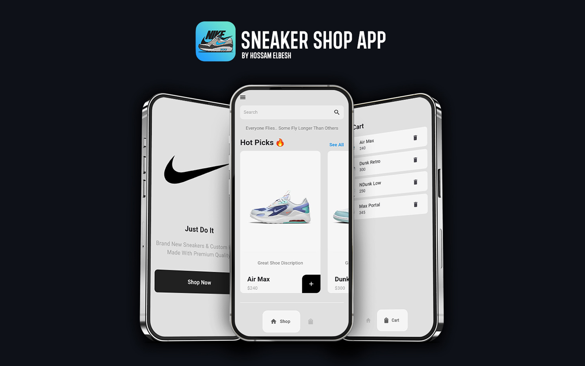

# Sneaker Shop

A Flutter application that allows users to browse and purchase sneakers. The app features a user-friendly interface, cart management, and responsive design.

## Features

- **Clean UI:** Modern, minimalist design with smooth navigation.
- **Product Listings:** Display sneaker details (name, price, description, image) and browse the collection.
- **Cart Management:** Add/remove sneakers from the cart with real-time updates via Provider.
- **Notifications:** Alerts for successful cart actions.
- **Responsive Design:** Works well across different screen sizes.

## Technologies Used

- **Flutter:** Cross-platform framework for Android and iOS.
- **Provider:** State management for handling cart operations.
- **Google Nav Bar:** Customizable bottom navigation bar.
- **Material Design:** Flutter's built-in UI components.
- **Asset Management:** Efficient sneaker image handling.

## Getting Started

This project is a starting point for a Flutter application.

A few resources to get you started if this is your first Flutter project:

- [Lab: Write your first Flutter app](https://docs.flutter.dev/get-started/codelab)
- [Cookbook: Useful Flutter samples](https://docs.flutter.dev/cookbook)

For help getting started with Flutter development, view the
[online documentation](https://docs.flutter.dev/), which offers tutorials,
samples, guidance on mobile development, and a full API reference.
